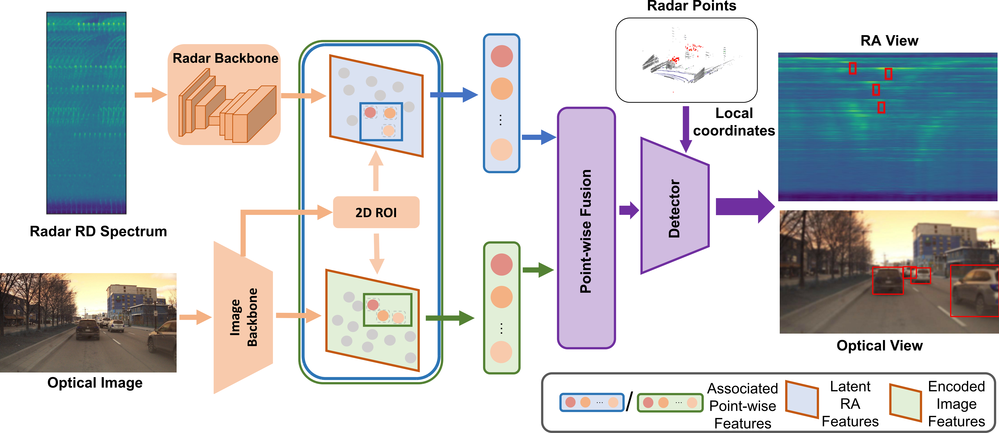

# ROFusion: Efficient Object Detection using Hybrid Point-wise Radar-Optical Fusion



## Overview

- [ROFusion: Efficient Object Detection using Hybrid Point-wise Radar-Optical Fusion](#rofusion-efficient-object-detection-using-hybrid-point-wise-radar-optical-fusion)
  - [Overview](#overview)
  - [Changelog](#changelog)
  - [Introduction](#introduction)
    - [Demo](#demo)
    - [Pre-trained models](#pre-trained-models)
    - [Citation](#citation)
  - [Dataset Preparation](#dataset-preparation)
  - [Installation](#installation)
    - [Requirements](#requirements)
    - [Installation](#installation-1)
  - [Usage](#usage)
    - [Train a mode](#train-a-mode)
    - [Test and evaluation the pretrained model](#test-and-evaluation-the-pretrained-model)
  - [Acknowledgements](#acknowledgements)
  - [License](#license)

## Changelog

[2023-08-19] ROFusion is released.

## Introduction

This work is based on our [arXiv tech report](https://arxiv.org/pdf/2307.08233.pdf), which is going to appear in ICANN 2023. We propose a hybrid point-wise Radar-Optical fusion approach
for object detection in autonomous driving scenarios. The framework benefits from dense contextual information from both the range-doppler spectrum and images which are integrated to learn a multi-modal feature representation. Furthermore, we propose a novel local coordinate formulation, tackling the object detection task in an object-centric coordinate. Extensive results show that with the information gained from optical images, we could achieve leading performance in object detection (97.69% recall) compared to recent state-of-the-art methods [FFT-RadNet](https://github.com/valeoai/RADIal.git) (82.86% recall). Ablation studies verify the key design choices and practicability of our approach given machine generated imperfect detections.

### Demo


### Pre-trained models

Pre-trained models can be downloaded [here](https://drive.google.com/file/d/1Kq177xLN4QLBbldaZvvO7JqmaEPUuD8X/view?usp=drive_link)


### Citation

If you find our work useful in your research, please consider citing:

```
@article{liu2023rofusion,
  title={ROFusion: Efficient Object Detection using Hybrid Point-wise Radar-Optical Fusion},
  author={Liu, Liu and Zhi, Shuaifeng and Du, Zhenhua and Liu, Li and Zhang, Xinyu and Huo, Kai and Jiang, Weidong},
  journal={arXiv preprint arXiv:2307.08233},
  year={2023}
}
```


## Dataset Preparation

This repo uses the RADIal dataset. Download the RADIal dataset as explained [here](https://github.com/valeoai/RADIal).

We pre-encode the dataset as follows:

```bash
cd PreEncoder
python predatase.py --config ../ROFusion_dataset.json --detector ${detector}
```

The YOLO label can be download [here](https://drive.google.com/file/d/1Otzp3CmgTY4GjpRxlNJFvuawDTEO_a_b/view?usp=drive_link). 

YOLO detection results are provided by [YOLOX](https://github.com/Megvii-BaseDetection/YOLOX.git)


There will generate 4 new dataset folders:

* Pre_PCL: Nontrivial radar point cloud that in image 2D bounding boxes.
* Center_Label: Encoded object center labels (rb, ab, rm, am)
* Point_Label: Nontrivial encoded radar point cloud labels
* Box_Radar_PCL: Radar point cloud that in image 2D bounding boxes.


We also provide the data generated after pre-encoding:

* [GT](https://drive.google.com/file/d/1pr0rSYd5fD7VDJxp86lwFj6_RQ-RbWB5/view?usp=drive_link)
* [YOLO](https://drive.google.com/file/d/1m8Le_coGL28Ha8IuvsoEfY8wlKl8Xsev/view?usp=drive_link)


## Installation

### Requirements

All the codes are tested in the following environment:

* Linux (tested on Ubuntu 20.04)
* Python 3.9
* Pytorch 1.11.0, Torchvision 0.12.0, CUDA 11.3, cuDNN 8.2

### Installation

1. Clone the repository:`git@github.com:LiuLiu-55/ROFusion.git`
2. Create a new conda environment: `conda create -n ROFusion python==3.9.7 `
3. Activate the environment using: `conda activate ROFusion`
4. Install the pytorch: `conda install pytorch==1.11.0 torchvision==0.12.0 cudatoolkit==11.3.1 cudnn=8.2.0 -c pytorch`
5. Install the requirements: `pip install -r requirements.txt`


## Usage

### Train a mode

```bash
python Train.py --config config/ROFusion.json
```

### Test and evaluation the pretrained model

* Test with a pretrained model

```bash
python Test.py --config config/ROFusion.json --checkpoint ROFusion_ResNet18_epoch24_loss_13.9696_AP_0.9914_AR_0.9914.pth
```

* Evaluation with a pretrained model

```bash
python Evaluation.py --config config/ROFusion.json --checkpoint ROFusion_ResNet18_epoch24_loss_13.9696_AP_0.9914_AR_0.9914.pth --detector ${Detector}
```

`--detector` is the option whether you use the YOLO 2D detection results.


## Acknowledgements

* https://github.com/Megvii-BaseDetection/YOLOX.git
* https://github.com/valeoai/RADIal.git


## License

ROFusion is released under the Apache 2.0 license. See `LICENSE.txt` for more information.